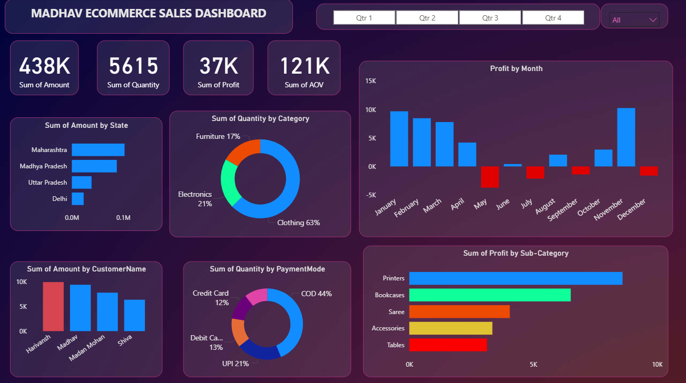

# powerbi_sales_dashboard
# 📊 Madhav Ecommerce Sales Dashboard

## 🔍 Overview

This project presents an interactive Power BI dashboard built to analyze ecommerce sales performance. It provides insights into revenue, profit trends, customer behavior, and product category performance using visually rich and dynamic reports.

The dashboard helps identify key business patterns, profit fluctuations, and customer purchasing trends.

---

## 🎯 Objectives

* Analyze overall sales and profitability
* Identify top-performing states, customers, and product categories
* Track monthly profit trends and detect loss periods
* Understand customer purchasing behavior and payment preferences

---

## 1) Data Sources

The dashboard is built using multiple datasets:

* `orders.csv` → Contains order-level data (Order ID, Order Date, State, Customer Name)
* `details.csv` → Contains product-level data (Category, Sub-Category, Quantity, Profit, Payment Mode)

These datasets were integrated using relationships in Power BI to create a unified data model for analysis.

---

## 2) Data Modeling

* Established relationships between tables using a common key (e.g., Order ID)
* Enabled cross-filtering between datasets for combined insights
* Cleaned and transformed data using Power Query

---

## 3) Key Metrics (KPIs) 📊

* **Total Revenue:** 438K
* **Total Quantity Sold:** 5615
* **Total Profit:** 37K
* **Average Order Value (AOV):** 121K

---

## 4) Dashboard Features

* KPI Cards for quick performance overview
* Monthly profit trend analysis (profit vs loss)
* State-wise revenue distribution
* Category-wise and sub-category-wise analysis
* Customer-level sales insights
* Payment mode distribution
* Interactive filters (Quarter selection)

---

##  Key Insights

### 1) Revenue & Profit

* The business generated a total revenue of **438K** with an overall profit of **37K**
* Profit margins vary significantly across months, indicating inconsistent performance

---

### 2) Monthly Trends

* **Highest profit observed in November and January**
* **Significant losses recorded in May, July, September, and December**
* Indicates possible seasonal demand fluctuations or cost inefficiencies

---

### 3) Category Performance

* **Clothing dominates sales with ~63% contribution**
* Electronics contributes around 21%
* Furniture contributes the least (~17%)

👉 Business is heavily dependent on clothing category

---

### 4) Sub-Category Insights

* **Printers generate the highest profit**
* **Bookcases also contribute significantly to profitability**
* **Tables show relatively lower profit**, indicating potential improvement area

---

### 5) State-wise Sales

* **Maharashtra leads in total sales**
* Followed by Madhya Pradesh and Uttar Pradesh
* Delhi contributes the least among the listed states

---

### 6) Customer Insights

* Certain customers (e.g., Harivansh, Madhav) contribute significantly more to revenue
* Indicates presence of high-value customers

---

### 7) Payment Mode Analysis

* **Cash on Delivery (COD) dominates with ~44%**
* UPI contributes around 21%
* Debit and Credit cards have lower usage

👉 Suggests strong preference for COD in customer base

---

##  Tools & Technologies

* Microsoft Power BI
* Power Query (Data Cleaning & Transformation)
* Data Modeling (Relationships)
* CSV datasets

---

##  Dashboard Preview 📷

---

##  Files Included

* `sales_dashboard.pbix` → Power BI project file
* `sales_dashboardpic.png` → Dashboard preview image
* `orders.csv` & `details.csv` → Dataset files

---

##  Future Improvements

* Add advanced DAX measures (Profit Margin, YoY Growth)
* Implement drill-through and tooltip pages
* Add region and category-level filters
* Optimize dashboard layout for better spacing and readability

---

##  Conclusion

This dashboard demonstrates strong capabilities in:

* Data visualization
* Business insight generation
* Data modeling using multiple datasets
* Analytical thinking and storytelling

---

 This project reflects the ability to transform raw data into actionable business insights using Power BI.
